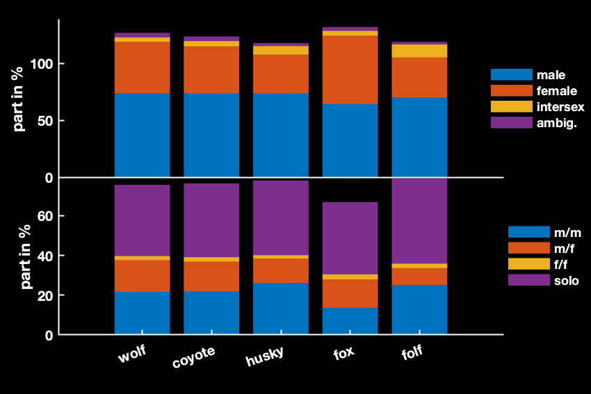
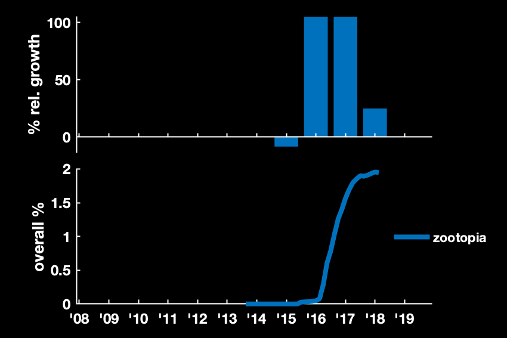
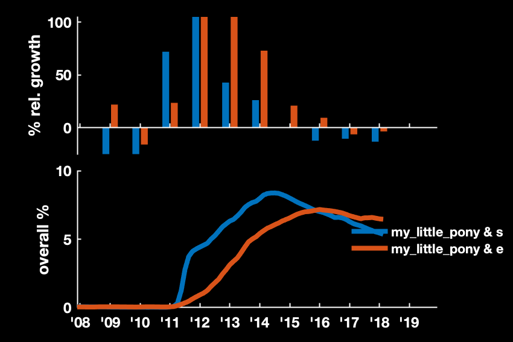

# e621-analytics

## Foreword

## Crawling
There are several python scripts, that crawl the basic JSON APIs from the server. Some depend on each other, so best run them in the following order, using python 3.6:

    $ python3 aliases.py
    $ python3 artists.py
    $ python3 users.py
    $ python3 tags.py
    $ python3 posts.py
    $ python3 favorites.py

You need the following dependencies:

* `tqdm`
* `requests`

## Analytics using RStudio
You can download RStudio for free from https://www.rstudio.com. However, the scripts included here are a bit outdated, the MATLAB versions are newer. You can install all missing packages within RStudio when needed.

## Analytics using Matlab
MATLAB is available to students for free, if your university has a volume license agreement. If you cannot get a version, please consider contributing a merge request in with the code rewritten in python.

## Examples

Figure 1: Sex and orientation of various canine species

Figure 2: When zootopia took off

Figure 3: For MLP, explicit content follows safe content